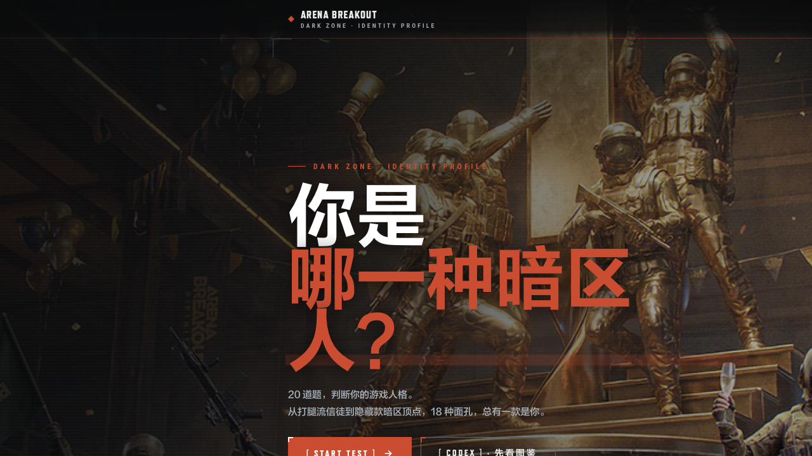
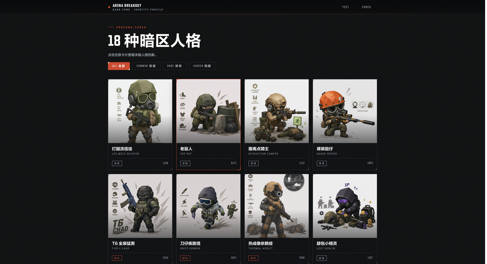
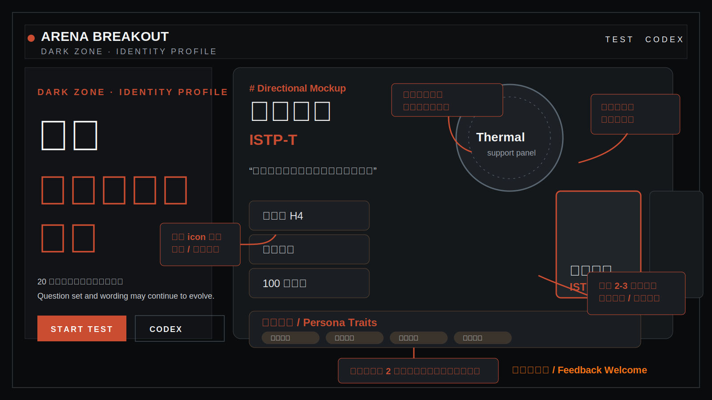

# 暗区人格 · DARK ZONE MBTI

一个基于《暗区突围》玩家气质、行为偏好和社区梗感制作的趣味人格测试项目。  
A lightweight personality quiz inspired by Arena Breakout player habits, playstyles, and shared community vibes.

这个项目更偏向“游戏化表达”和“角色感归纳”，不是公开的人格测量体系。  
This project is meant to be playful and expressive rather than a public or formal personality framework.

## 项目怎么 Work
## How It Works

当前体验主要由两部分组成：  
The current experience has two main entry points:

1. `TEST`
用户从主页进入测试，按顺序完成题目，并根据自己的习惯选择最贴近的选项。  
Players start from the home page, answer the quiz in sequence, and choose the option that best matches their in-game habits.

2. `CODEX`
用户也可以直接进入图鉴页，不做题也能先浏览全部人格设定、视觉形象和整体气质。  
Players can also jump straight into the codex to browse all personas, visuals, and overall tone without taking the quiz first.

完成测试后，系统会给出一个对应的人格结果，并展示该人格的名称、标签和描述信息。  
After the quiz, the project returns a matching persona with its name, labels, and flavor description.

## 不公开的部分
## What Is Intentionally Not Public

- 不公开人格计算方式。  
  The persona calculation logic is intentionally not public.
- 不公开具体判定权重或映射细节。  
  Specific weights, mappings, or scoring details are intentionally hidden.
- 判定逻辑后续可能继续调整。  
  The internal logic may continue to evolve over time.

这样做是为了保留测试的趣味性、结果分布的灵活性，以及后续迭代空间。  
This keeps the experience flexible, playful, and easier to iterate on over time.

## 关于题目和选项
## About The Questions And Options

当前版本的题目和选项不是最终定稿，后续可能继续变化。  
The current questions and options are not final and may continue to change.

可能的更新包括：  
Possible updates include:

- 题目数量调整  
  Changes to the number of questions
- 题干重写  
  Rewriting question prompts
- 选项表达优化  
  Improving how answer choices are phrased
- 人格文案更新  
  Updating persona copy and tone
- 图鉴信息扩展  
  Expanding codex details and supporting information

换句话说，这个项目的测试内容会持续打磨。  
In other words, the quiz content is designed to stay iterative.

## 图 1：主页示意图
## Figure 1: Home Page Overview

主页负责建立整体氛围，并给用户两个最清晰的入口：开始测试，或者先看图鉴。  
The home page sets the tone of the project and offers two clear actions: start the test or browse the codex first.

## 图 2：图鉴页
## Figure 2: Codex Page

图鉴页用于集中展示全部人格卡片，帮助用户快速理解这套人格宇宙的构成。  
The codex page is a compact gallery of all personas, helping users understand the broader persona universe at a glance.

## 图 3：主页更新方向
## Figure 3: Home Page Update Direction

主页后续希望往“更强的角色展示 + 更完整的世界观引导 + 更清晰的信息层级”继续推进。  
The next direction for the home page is to strengthen character presentation, worldbuilding cues, and information hierarchy.

这张图不是最终 UI，而是一个方向示意：  
This figure is not a final UI spec. It is a directional concept showing where the page may evolve:

- 让主角色与背景氛围融合得更自然  
  Blend the main character more naturally into the scene
- 把人格辅助信息改成更易读的标签或芯片模块  
  Turn supporting persona info into more readable tag or chip modules
- 用少量预览卡增强首页与图鉴之间的联动  
  Add a small number of preview cards to connect the home page with the codex
- 保持暗区风格的一体化视觉语言  
  Keep the visual language consistent with the Dark Zone theme

## 欢迎提意见
## Feedback Welcome

欢迎继续提出想法和建议，尤其是这些方向：  
Feedback is welcome, especially around:

- 哪些题目更有暗区味  
  Which questions feel most true to Arena Breakout
- 哪些人格更有代表性  
  Which personas feel the most iconic or recognizable
- 哪些文案更有梗、更贴近玩家表达  
  Which copy feels sharper, funnier, or closer to player language
- 图鉴页还应该补哪些信息  
  What extra information the codex should include
- 首页后续应该强化哪些视觉重点  
  Which visual priorities the home page should emphasize next

欢迎提意见，一起把这套暗区 MBTI 打磨得更完整、更好玩。  
Suggestions are always welcome. The goal is to keep making this Arena Breakout MBTI more complete and more fun.
